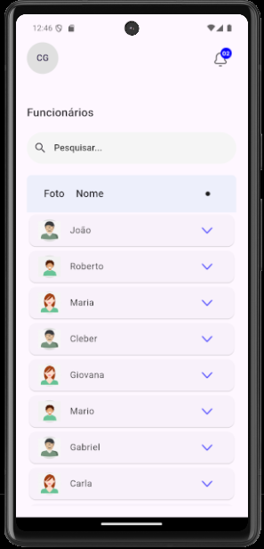
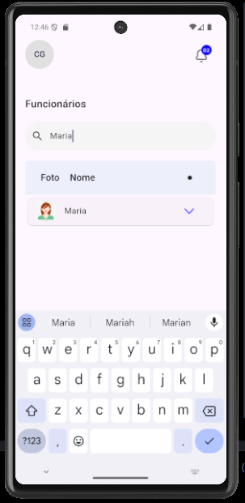
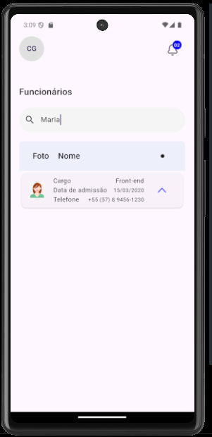

<h1 align="center" style="font-weight: bold;">BeTalent 💻</h1>

<p align="center">
 <a href="#tech">Technologies</a> • 
 <a href="#started">Getting Started</a> • 
  <a href="#author">Author</a> •
 <a href="#contribute">Contribute</a>
</p>

<p align="center">
    <b>Recruitment App // CHALLENGE</b>
</p>

<p align="center">
     <a href="">📱 Visit this Project</a>
</p>

<h2 id="layout">🎨 Layout</h2>

<p align="center">
    
    
    
</p>

<h2 id="technologies">💻 Technologies</h2>

- Flutter/Dart
- API
- Provider
- Intl
- Dio


<h2 id="started">🚀 Getting started</h2>

For help getting started with Flutter, view our online [documentation](https://flutter.dev/).

<h3>Prerequisites</h3>

Here you list all prerequisites necessary for running your project. For example:
- [VsCode](https://code.visualstudio.com/)
- [Flutter](https://flutter.dev/)
- [JavaSDK](https://www.oracle.com/br/java/technologies/downloads/)
- [Android Studio](https://developer.android.com/studio?hl=pt-br)

<h3>Cloning</h3>

How to clone your project

```bash
git clone betalent
```

<h3>Starting</h3>

How to start your project

```bash
cd betalent
flutter run
```

<h2 id="author">🤝 Author</h2>

[Call me](https://bento.me/suamirochadev)

<table>
  <tr>
    <td align="center">
      <a href="#">
        <br>
        <sub>
          <b>Suami Rocha</b>
        </sub>
      </a>
    </td>
  </tr>
</table>

<h2 id="contribute">📫 Contribute</h2>

Here you will explain how other developers can contribute to your project. For example, explaining how can create their branches, which patterns to follow and how to open an pull request

1. `git clone https://github.com/betalent/`
2. `git checkout -b feature/NAME`
3. Follow commit patterns
4. Open a Pull Request explaining the problem solved or feature made, if exists, append screenshot of visual modifications and wait for the review!

<h3>Documentations that might help</h3>

[📝 How to create a Pull Request](https://www.atlassian.com/br/git/tutorials/making-a-pull-request)

[💾 Commit pattern](https://gist.github.com/joshbuchea/6f47e86d2510bce28f8e7f42ae84c716)